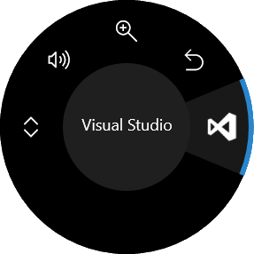

# Surface Dial Tools for Visual Studio

<!-- Update the VS Gallery link after you upload the VSIX-->
Download this extension from the [VS Gallery](https://visualstudiogallery.msdn.microsoft.com/[GuidFromGallery])
or get the [CI build](http://vsixgallery.com/extension/d4ce1d82-9bf6-4136-bd56-43cde615e0db/).

---------------------------------------

Adds features to Visual Studio specific to the Surface Dial.

See the [change log](CHANGELOG.md) for changes and road map.

## Features

- Solution Explorer navigation
- Debugger commands
- Error navigator
- Lighten/brighten hex colors
- Increase/decrease numbers

### Solution Explorer navigation
When the Solution Explorer tool window is active, you can use the dial to navigate it.

- **Rotate right**: does the same as arrow down
- **Rotate left**: does the same as arrow up
- **Click**: expands/collapses folders and parent items

### Debugger commands
When a breakpoint is hit, use the dial to step into, over and out.

- **Rotate right**: step over
- **Rotate left**: step out
- **Click**: step into

### Error navigator
When the error list contain errors, the dial makes it easy to navigate to the next error in the list.

- **Rotate right**: go to next error
- **Rotate left**: go to previous error
- **Click**: [no action]

### Lighten/brighten hex colors
Hex colors found primarily in .css files can be lightened and darkened easily. Place the caret in a hex value (e.g. `#ff0000`) and rotate the dial.

- **Rotate right**: lightens the color value
- **Rotate left**: darkens the color value
- **Click**: [no action]

### Increase/decrease numbers
When the caret is located in any number, you can increase and decrease the numerical value.

- **Rotate right**: increase the number
- **Rotate left**: decrease the number
- **Click**: [no action]

## Contribute
Check out the [contribution guidelines](.github/CONTRIBUTING.md)
if you want to contribute to this project.

For cloning and building this project yourself, make sure
to install the
[Extensibility Tools 2015](https://visualstudiogallery.msdn.microsoft.com/ab39a092-1343-46e2-b0f1-6a3f91155aa6)
extension for Visual Studio which enables some features
used by this project.

## License
[Apache 2.0](LICENSE)