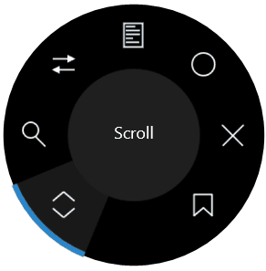

# Surface Dial Tools for Visual Studio

Download this extension from the [Marketplace](https://marketplace.visualstudio.com/items?itemName=MadsKristensen.SurfaceDialToolsforVisualStudio)
or get the [CI build](http://vsixgallery.com/extension/d4ce1d82-9bf6-4136-bd56-43cde615e0db/).

---------------------------------------

Adds features to Visual Studio specific to the [Surface Dial](https://www.microsoftstore.com/store/msusa/en_US/pdp/Surface-Dial/productID.5074013900). You don't need a Surface Book or Surface Studio to take advantage of the Surface Dial.

A Surface Dial is $99 and works with all modern Windows 10 PCs. [Get yours today!](https://www.microsoftstore.com/store/msusa/en_US/pdp/Surface-Dial/productID.5074013900)

See the [change log](CHANGELOG.md) for changes and road map.

## Features

- Status bar indicator
- Scrolling
- Zooming
- Navigation
- Debugging
- Errors
- Editor shifters
- Bookmarks

### Status bar indicator
An icon is placed at the left corner of the Status Bar indicating the current state of the Dial. 

When the Visual Studio item on the Dial menu hasn't been activated, the status bar icon looks like this

When it is active, the icon changes to a solid white dot and a label showing what the selected menu item is appears.

### Scrolling
Scroll documents and tool windows. 

- **Rotate right**: does the same as arrow down
- **Rotate left**: does the same as arrow up
- **Click**: In a document it opens the context menu, otherwise it does the same as then ENTER key. In Solution Explorer it expands/collapses folders.

### Zooming
Zooming is enhanced so that it only zoom the text editors and not other artifacts in Visual Studio

- **Rotate right**: Zoom in
- **Rotate left**: Zoom out
- **Click**: Resets zoom level to 100%

### Navigation
Takes you to the previous and next location in your files.

- **Rotate right**: navigates forward
- **Rotate left**: navigates backwards
- **Click**: [nothing]

### Debugging
When a breakpoint is hit, use the dial to step into, over and out.

- **Rotate right**: step over
- **Rotate left**: step out
- **Click**: step into

When a breakpoint is hit, the Debug dial item is automatically activated as well

### Errors
When the error list contain errors, the dial makes it easy to navigate to the next error in the list.

- **Rotate right**: go to next error
- **Rotate left**: go to previous error
- **Click**: Show the Error List

When the Error List window is activated, the Errors dial item is automatically activated if it contains any errors.

### Editor shifters
Shifting is a way to modify text in the editor based on the Dial rotation. When the caret is placed in a supported position, the shifting is enalbed.

#### Hex colors (e.g. #ff000)
- **Rotate right**: lightens the color value
- **Rotate left**: darkens the color value
- **Click**: [no action]

#### Numbers (e.g. 123 or 3.4 or .6)
- **Rotate right**: increase the number
- **Rotate left**: decrease the number
- **Click**: [no action]

### Bookmarks
Set and navigate to your bookmarks

- **Rotate right**: next bookmark
- **Rotate left**: previous bookmark
- **Click**: toggle bookmark

When the Bookmarks window is activated, the Bookmarks dial item is automatically activated as well.

## Suggest new behaviors
Please send ideas about new behaviors you would find helpful to the [GitHub issue tracker](https://github.com/madskristensen/DialToolsForVS/issues).

## Contribute
Check out the [contribution guidelines](.github/CONTRIBUTING.md)
if you want to contribute to this project.

For cloning and building this project yourself, make sure
to install the
[Extensibility Tools 2015](https://visualstudiogallery.msdn.microsoft.com/ab39a092-1343-46e2-b0f1-6a3f91155aa6)
extension for Visual Studio which enables some features
used by this project.

## License
[Apache 2.0](LICENSE)